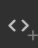
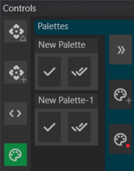

# Canvas Window

Moving past the basics of show designing, there are many ways to make the show more flexible, efficient, and powerful.

## Group Gizmos

It is often advantageous to select multiple gizmos at a time to manipulate them as one, without binding them all to the same gizmo. A Group Gizmo allows linking multiple gizmos together so that clicking the Group Gizmo selects all the gizmos linked to it.

You can create a Group Gizmo in the Canvas Window by clicking the  button. Any gizmos that are actively selected at the time the Group is created will be linked to the Group Gizmo.

To modify the selected gizmos, select a new set of gizmos you want linked, then click the Link Button  in the Canvas Window, followed by the Group Gizmo you want to modify. It will be updated with the new set of gizmos.

## Macro Gizmos

Macro Gizmos enable limited scripting capabilities. Create a Macro Gizmo by clicking the Macro button . In the Property Editor for this Gizmo, an array of actions can be defined. These actions are executed whenever the button is clicked.

Available actions:

- **Media** - Plays selected media on a targeted Gizmo. This is equivalent to dragging a cue onto the Canvas to create an Event Cue.
- **Set Next Cue** - Sets the next cue to the specified cue target.
- **Run Cue** - Runs a cue directly without setting the next cue.
- **Clear** - Clears channels on the target gizmo(s).
- **Home** - Sets all channels to Home on the target gizmo(s).
- **Intensity** - Sets the intensity channel on the target gizmo(s) to a specified value.
- **Color** - Sets the color channels on the target gizmo(s) to a specified value using the `#rrggbb` format.

# Media Window

## Media Properties and Instancing

The Media Window allows duplicating media so multiple versions can be referenced with different properties without modifying the original source data. Selecting a media entry and clicking the Duplicate button creates an identical Media entry in the Media Window.

Modifiable properties include:

- **Start and Duration** - Adjust the start time and duration to create sub-clips or loop segments.
- **Looping** - Enables infinite looping of the media instance.
- **Visual - Blend Type** - Defines how a visual image composites with other visuals:
  - **Alpha** - Blends based on the alpha channel (default).
  - **Add** - Adds the image values on top of the existing channel (used for rain/snow effects with a black background).
  - **Multiply** - Multiplies the image value with the underlying value.
  - **Vignette** - Blends using the inverted alpha value (used for vignette effects).
- **Audio - Gain** - Adjusts the gain of the media.
- **Audio - Pan** - Modifies panning between left and right channels.
- **Audio - Pitch** - Alters pitch, useful for recomposing music (extreme adjustments may degrade sound quality).

## Channel Effects

Channel Effects dynamically drive channels to create effects like flickering flames or magical energy ramp-ups.

To create an effect:
1. Click the Add Effect button in the Media Toolbar.
2. In the Property Editor, add multiple effects targeting specific channels (e.g., intensity, fade, pan).

Effect types:

- **Static** - Specifies a fixed value for the channel.
- **Wave** - Generates a sine wave effect.
- **Pulse** - Creates a pulsing effect.
- **Cycle** - Cycles between multiple values.

Common effect properties:

- **Frequency** - Determines how often (in seconds) the effect repeats.
- **Offset** - Defines the starting point within the effect when first triggered.
- **Randomize** - Introduces randomness to the effect.
- **UniqueInstance** - Assigns a unique starting offset and seed values per gizmo (useful for independent light flickers).

To assign an effect, drag it onto the Channel Window when a Gizmo is selected, onto the Gizmo itself, or as a Play Effect action in a cue.

## Palettes

Palettes store preset values for specific gizmos and channels, enabling reuse across multiple cues.

Example: For a four-person band setup, a "Drummer" palette can be created, storing the position of lights directed at the drummer. Adjusting the "Drummer" palette updates all related cues automatically.

Palettes can be used for:
- **Colors** (e.g., sky color, wash color)
- **Movers' positions** (e.g., stage right, stage left)
- **Other channel values**

### Creating and Using Palettes

1. Create a palette in the Media Window or in the Controls Window via the Palette Drawer.
2. Apply a palette by clicking the Experiment button in the Palette Drawer.
3. To record new values, enable "Make Palettes Writable" and adjust channel values before clicking the Record button.
4. Modify palettes using the Property Editor in the Media Window or the Palette Drawer.

## Shader Effects

Shader Effects provide advanced visual effects that enhance video and images displayed on a Visual Gizmo.

For examples, visit: [ShaderToy](http://www.shadertoy.com).

Shader Effects are a type of media file requiring hand-editing. Existing shader effects in Masque can be explored to understand how to:
- Define **controllable parameters**
- Write **shader code** that interacts with those parameters

---

