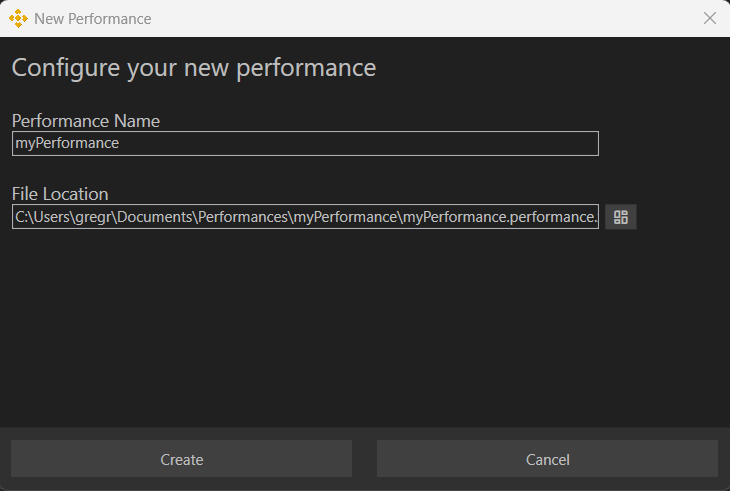

# Setting Up a Station

A **Station** contains cue lists, cues, actions, and gizmos. It also includes a **Venue** definition, which consists of devices, fixtures, and fixture definitions. **Gizmos** and **fixtures** are patched together so that cue actions can control the gizmos, which in turn drive the fixtures. Currently, only one **Venue** is supported per Station.

You can create a new **Station** through the **Performance Wizard** or by clicking the **+** button on the **Performance Bar** next to the station selection dropdown.

All **Venue** information is available in the **Devices Window**, accessible from the app’s sidebar.

## Creating a New Performance

To set up a Station, you need a **Performance**. If you’re not using an existing one, create a new Performance from the **Welcome Screen** or **Menu dropdown**.

### New Performance Wizard

The **New Performance Wizard** guides you through creating a performance. Start by assigning it a name and choosing a file location. By default, performances are stored in `My Documents\Performances`.

A **Performance** consists of multiple **Stations** that share media for synchronized execution. This includes:

- Audio and Video Media
- Palettes
- Effects
- Shader Effects

After setting up a performance, the wizard proceeds to the **New Station Wizard**.

## Setting Up a New Station

### Import a Previous Station

Importing a station preserves **devices, fixtures, and patching** from an existing performance. It does **not** import:

- Media
- Cues
- Cue Lists

### Create a Default Station

These pre-configured stations help you get started quickly:

- **Audio Station** – Includes default audio track fixtures.
- **Projection Station** – Comes with preconfigured video layer fixtures.
- **Lighting Station** – No default fixtures (as setups vary per production).

### Create a Custom Station

When setting up a **Custom Station**, you can:

1. Add devices and assign fixtures before completing setup.
2. Create an empty station and configure it later.

Once a station is created, additional fixtures and devices can be added.

## Editing Station Information

To modify station details:

1. Click the **Edit** button next to the **Station dropdown** in the **Performance Bar**.
2. You can rename the station, add a description, or locate it on disk.

## Exporting Station Cues

In the **Property Inspector**, you can export all cues for a station using the **Export** button.

## Configuring Devices

The **Device Window** provides device management options:

- **Top-left corner** – Add new **DMX, Audio, or Video** devices.
- **Top-right corner** – Open the **Patch Window** and **Fixture Library**.
- **Middle section** – Displays the active **Venue** (only one supported).
- **Device List** – Shows available devices, their configurations, and outputs.

### Selecting Device Outputs

#### Audio Output

- Headphones, internal speakers, or other available audio devices.
- Multiple audio devices can target different outputs simultaneously.

#### DMX Output

- USB-to-DMX dongles.
- Future support for **Art-Net universe**.

#### Video Output

- **Preview Window** – Resizable within the application.
- **Monitor or Projector** – Fullscreen output for external displays.

## Adding Fixtures

Each device has three fixture-related buttons:

- **Add a new fixture**
- **Show/hide fixture list**
- **Show/hide fixture channel values**

### Fixture List

For each fixture, the list displays:

- **Start address**
- **Fixture name**
- **Channel definitions**
- **Duplicate and delete options**

Selecting a fixture opens the **Property Inspector**, where you can:

- Modify start addresses.
- Rename fixtures.
- Change fixture definitions.

If fixture channels overlap, the row is highlighted **red** to indicate a potential misconfiguration.

### Duplicating Fixtures

To quickly configure multiple fixtures of the same type, use the **Duplicate** button. The new fixture adopts the same definition and is assigned an appropriate address.

### Adding a Fixture

- **Blank Fixture** – Click **+** to add a new fixture with the most recently used definition.
- **From Fixture Library** – Open the **Fixture Library Window** to browse and drag a fixture definition onto the device.

### Creating a Custom Fixture Definition

If no suitable definition exists, create a **Custom Fixture Definition** by:

1. Clicking the **+** button in the top-right corner.
2. Providing **name, mode, and channels**.

For **DMX devices**, fixture definitions are sourced from [Open Fixture Library](https://open-fixture-library.org/).

## Patching Gizmos

By default, Masque generates a **Gizmo** for each fixture in a Venue. This behavior can be adjusted in settings.

- **Single Gizmo -> Single Fixture** – Renaming affects both.
- **Single Gizmo -> Multiple Fixtures** – Allows controlling multiple fixtures as one.

### Case Study: Controlling Multiple CYC Fixtures with One Gizmo

Using a single Gizmo for multiple **CYC fixtures** simplifies control. To patch fixtures:

1. Open the **Patch Window** (cable button in **Devices Window**).
2. Drag fixtures onto the Gizmo you want to control them.

## Laying Out Gizmos on the Canvas  

Each Gizmo created is automatically placed on the Canvas. While the system attempts to arrange them logically, they often need adjustment to suit the user's needs.  

  

### Moving and Aligning Gizmos  

Click the **Translate** button in the Canvas Toolbar to enable movement and rotation controls for each Gizmo. Alignment buttons will also appear, allowing you to easily align multiple Gizmos with one another.  

---
