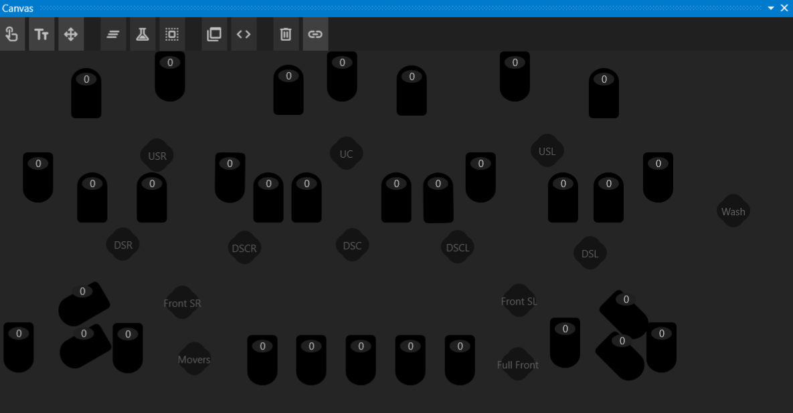
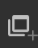

# Canvas Window

  

There are many ways to make the show more flexible, efficient, and powerful. The Canvas Window provides a graphical overview of the Performance.

Everything that appears in the Canvas is a Gizmo. Gizmos represent hardare, actions, and state needed to visualize the state of the show.

## Group Gizmos

It is often advantageous to select multiple gizmos at a time to manipulate them as one, without binding them all to the same gizmo. A Group Gizmo allows linking multiple gizmos together so that clicking the Group Gizmo selects all the gizmos linked to it.

You can create a Group Gizmo in the Canvas Window by clicking the  button. Any gizmos that are actively selected at the time the Group is created will be linked to the Group Gizmo.

To modify the selected gizmos, select a new set of gizmos you want linked, then click the Link Button  in the Canvas Window, followed by the Group Gizmo you want to modify. It will be updated with the new set of gizmos.

## Macro Gizmos

Macro Gizmos enable limited scripting capabilities. Create a Macro Gizmo by clicking the Macro button . In the Property Editor for this Gizmo, an array of actions can be defined. These actions are executed whenever the button is clicked.

Available actions:

- **Media** - Plays selected media on a targeted Gizmo. This is equivalent to dragging a cue onto the Canvas to create an Event Cue.
- **Set Next Cue** - Sets the next cue to the specified cue target.
- **Run Cue** - Runs a cue directly without setting the next cue.
- **Clear** - Clears channels on the target gizmo(s).
- **Home** - Sets all channels to Home on the target gizmo(s).
- **Intensity** - Sets the intensity channel on the target gizmo(s) to a specified value.
- **Color** - Sets the color channels on the target gizmo(s) to a specified value using the `#rrggbb` format.

## System Gizmos

System Gizmos provide additional controls that are not tied to hardware, audio, or video. They are often used in conjunction with the **Drivers Window** for enhanced control.

Add a system gizmo using the  button

- **Virtual Fader** - A gizmo with 8 faders that function like a submaster, controlling multiple other faders.
- **Color Faders** - A gizmo with a single color fader that can drive multiple other color faders.
- **State Buttons** - Toggle buttons that output either full OFF or full ON, useful for adjusting the drivers graph.
- **Game Controller** - Feeds game controller inputs into the drivers graph.

## Gizmo Layout

When created, each Gizmo created is placed on the Canvas. While the system attempts to arrange them logically, they often need adjustment to suit the user's needs.  

Click the **Translate** button in the Canvas Toolbar to enable movement and rotation controls for each Gizmo. Alignment buttons will also appear, allowing you to easily align multiple Gizmos with one another.  

---

