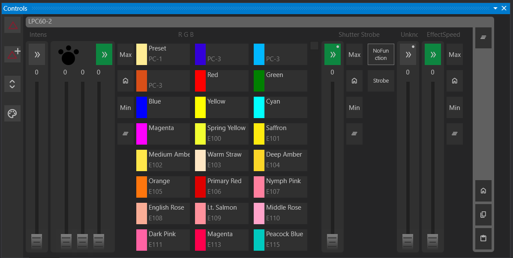
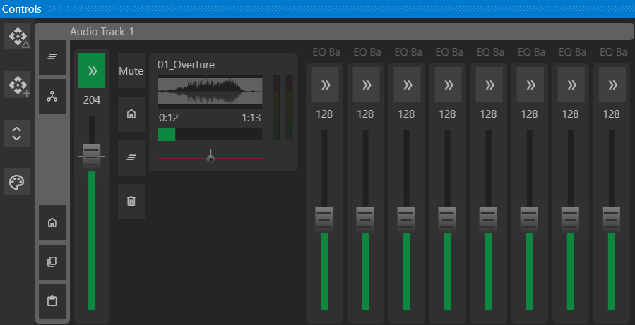
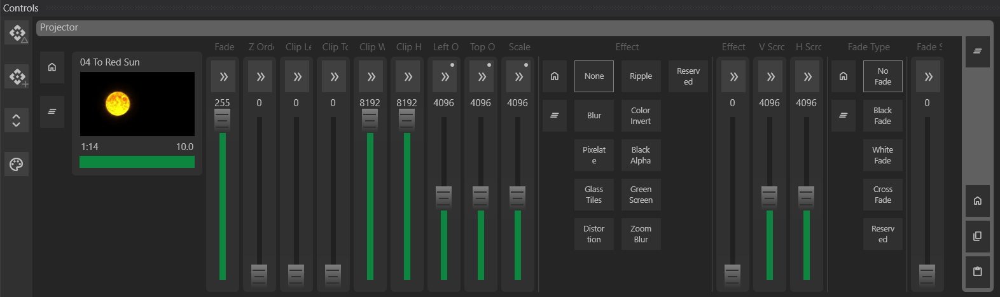
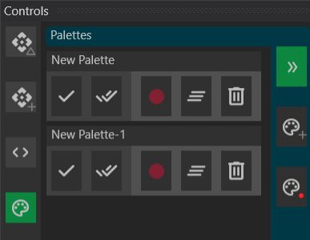

# Controls Window

The Controls Window allows manipulation of gizmos and channels, including recording, editing, and applying cues and palettes. Selecting a Gizmo in the Canvas will expose its controls in the Controls Window.
Multiple Gizmos can be selected by holding the `Ctrl` key while clicking on them. Common channels will be shown by default. Clicking the Expand channel button `< >` will show all channels for the selected Gizmos.

## Faders

Faders control the intensity of a channel or group of channels. They can be used to adjust the intensity of a light, the volume of an audio track, or the position of a mover.

### Expanded Faders

Clicking the Expand button on a fader reveals additional controls, such as:

- Explicit values set by the fixture. These are displayed as buttons on the fader. Clicking the button sets the fader to that value.
- Max, Min, and Home values as defined by the fixture. These can also be defined by the user in the Inspector when the gizmo is clicked on. Setting the Min and Max can restrict the range of the fader, while the Home value can be used to reset the fader to a specific value.
- Clear button that removes any experimental values set by the user. This will outline the fader in green if there is an experimental value.

### Fader Values

Experimental values are temporary values set by the user. They are indicated by a green outline on the fader. Experimental values can be recorded to a cue with the Record Cue button on the left panel. Or recorded to a NEW cue with the Record New Cue button. An experimental value takes precedence over all other values.

Driven values are the results of a node evaluation from the Drivers Window. If the channel is driven, it has an orange outline. Driven values take precedence over cued values.

Cued values are the results of actions taken in the cueing system. This is the lowest predecent value. There is no special highlight for this state.

## Control Groups

- **Simple Fader** – Controls a single channel.
- **Color Fader** – Controls multiple channels, such as RGB. Shows the mixed color and the individual RGB colors. The expanded view shows a list of color options.
- **Video Fader** - Shows customized controls for Video playback.
- **Audio Fader** - Shows customized controls for Audio playback. Includes Pan, Pitch, and Gain controls.

{ width=75% }

{ width=75% }

## Palettes
Palettes store preset values for specific gizmos and channels, enabling reuse across multiple cues.

Example: For a four-person band setup, a "Drummer" palette can be created, storing the position of lights directed at the drummer. Adjusting the "Drummer" palette updates all related cues automatically.

Palettes can be used for:
- **Colors** (e.g., sky color, wash color)
- **Movers' positions** (e.g., stage right, stage left)
- **Any channel values**

Palettes can be applied to just the selected Gizmos, or to all gizmos with a palette value stored. In this way, a Palette can also be used to store and restore an entire Scene.

### Using Palettes

- Apply a palette to the selected Gizmos by clicking the Check button in the Palette Drawer.
- Apply a palette to ALL recorded Gizmos by clicking the Check All button in the Palette Drawer.

### Creating Palettes

- Create a Palette the Create Empty Palette button in the Palette Drawer. You can also create an empty Palette in the Media Window.
- Create a Palette with the current values of the selected Gizmos by clicking the Record button in the Palette Drawer.

### Editing Palettes

Expand the Palette Drawer using the Expand button to expose additional editing controls.

- To record new values, adjust control faders so they are not default, and click the Red Record button on the Palette you want to record to. The Palette will record just the values that have changed on the selected gizmos.
- Continue to add new values or overwrite existing recorded values with this same record button.
- Clear all currently recorded values in the palette by clicking the Clear Palette button.
- Delete the Palette completely by clicking the Delete Palette button.

---

