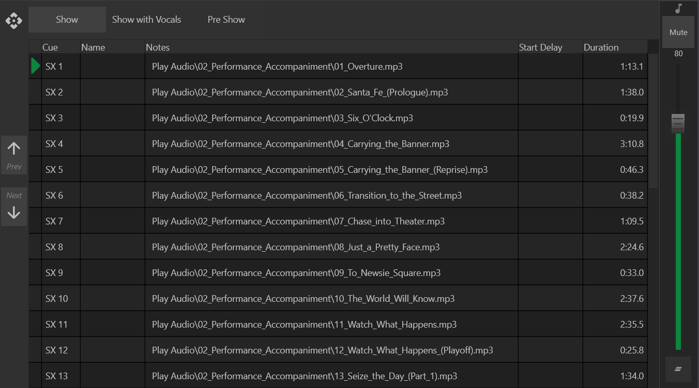
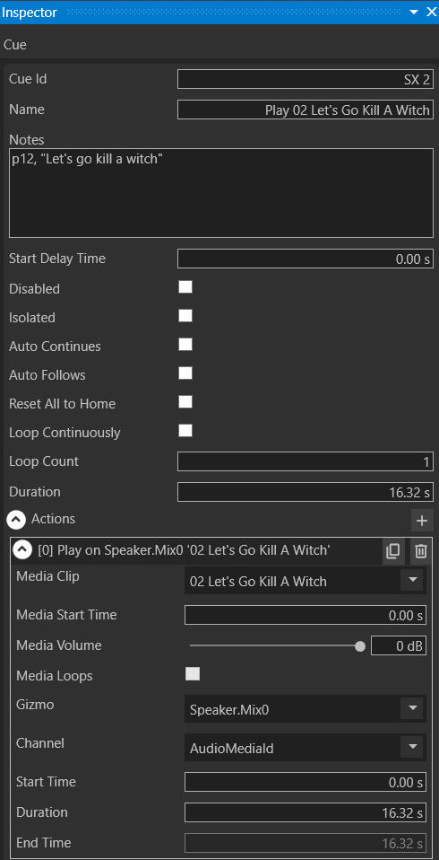
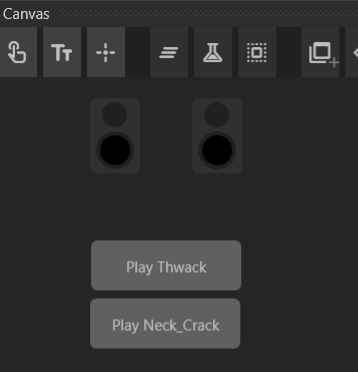
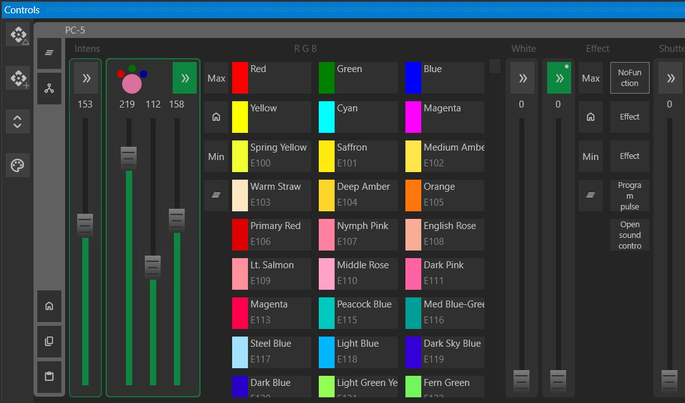
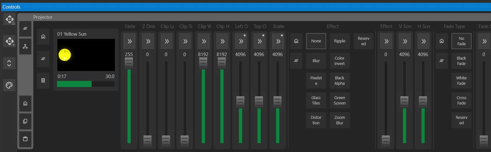

# Designing a Performance

## Creating Cues

{ width=75% }

### Cues and Cue Lists

A default cue list is generated when you create a new Performance. You can add, rename, and delete cue lists from the **Cue List Bar** at the top of the Cue Window. This allows you to create different cue lists for various situations (e.g., pre-show, post-show, tracks with or without vocals).  

A cue is a set of triggerable actions. A **Cue Action** sets the channel of a fixture to a value over a period of time. This can be a simple linear transition from one value to another, or it can be the result of an effect that dynamically changes the value over time using curves or waves.  

Cues can be configured to trigger at different times, create sequential effects, loop indefinitely, or trigger other cues.  

In **Design Mode**, the currently active cue is highlighted in green, indicating that any modifications will apply to it.

### Adding Cues

To create a cue:  

- Click the **Add** button on the left sidebar of the cue list.  
- This will give you four options:
	- **Add Cue from Media** ? Creates a new cue from a media file.
	- **Add Cue from Control Values** ? Creates a new cue from the changed values in the Controls Window.
	- **Duplicate Selected Cue** ? Duplicates the currently selected cue and places it after the selected cue.
  - **Add Empty Cue** ? Creates a new cue after the currently selected cue.
- You can then add additional actions by:  
  - Dragging a media file onto the cue.  
  - Recording new channel values in the **Controls Window**.  
  - Adding new action tracks in the **Timeline Window**.

### Creating Cues from Media

You can drag **audio and video files** directly onto the cue list. The cues will be added in alphabetical order by name, and each media file will be assigned to a single cue. The system will automatically assign the media to the first available gizmo that can handle it.  

{ width=50% }

In the **Property Inspector**, you can change which gizmo the media is assigned to. The cue can be run in **Design Mode** by:  

- Double-clicking the cue.  
- Pressing the **GO** button when it is the next cue to play.

### Creating Isolated Event Cues

By default, cues are sequential and designed to play in order from top to bottom. However, you may want some cues to be triggered at any time.  

To create an **Event Cue**:  

- Toggle the `Isolated` property to **true** in the **Property Inspector**.  
- Drag the cue from the **Cue List** onto the **Canvas**, creating a button that can trigger it at any time.  

{ width=50% }

**Note:** Any cue can be dragged onto the Canvas. If a sequential cue is triggered this way, it will be set as the next cue. If it is an isolated/event cue, it will play immediately.

### Creating Cues from Controls

To access **Controls**, select a Gizmo from:  

- The **Device Window**  
- The **Canvas Window**  
- The **Patch Window**  

If multiple Gizmos are selected, only common controls will be shown by default. You can toggle the **Expansion Button** in the left sidebar to show all controls.

#### Channel Value Modification

You can modify Gizmo channel values directly.  

- Gizmos with modified channels are highlighted in **green**.  
- To reset a channel to its current cued value, click the **reset button**.  
- The **reset all** button clears all modified channels.

#### Additional Controls

Click the `>>` button to expand a channel for additional options, including:  

- Setting the control to **Min, Max, or Home** values.  
- Clearing modifications.  
- Using coarse and fine control sliders (for precision adjustments).  
- Choosing colors for color channels.  
- Selecting predefined value ranges.

{ width=100% }

{ width=100% }  

Audio and Video gizmos have custom interfaces for better control over their parameters.

#### Recording Values

Once Gizmo channels are adjusted, you can record them into a cue using two buttons in the left **Controls Window** sidebar:  

- **Delta Recording** (Cue symbol with a triangle) ? Saves modified values to the **currently active cue**.  
- **New Recording** (Cue symbol with a plus) ? Creates a **new cue** directly after the active cue and records the modified values.  

To verify the recorded values, navigate to the previous cue and then back to the newly recorded cue.

## Creating and Modifying Actions

### Cue Actions

Cues can include multiple **actions**, each with properties that define how they interact with Gizmos. Some available actions include:

- **Play Media Action** ? Plays a media file on a Gizmo.  
- **Set Value** ? Gradually changes a channel value over time.  
- **Set Home** ? Returns a channel to its defined home value.  
- **Play Effect** ? Runs an effect on a Gizmo, targeting multiple channels.  
- **Set Palette** ? Applies predefined values from a palette.  
- **Stop Cue** ? Instantly stops a playing cue.

You can also create Actions in the Timeline Window. See the [Timeline Window](Timeline.md) documentation for more information.

---
