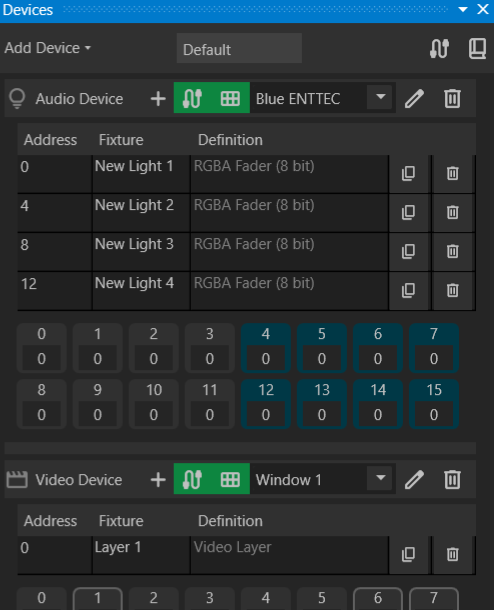
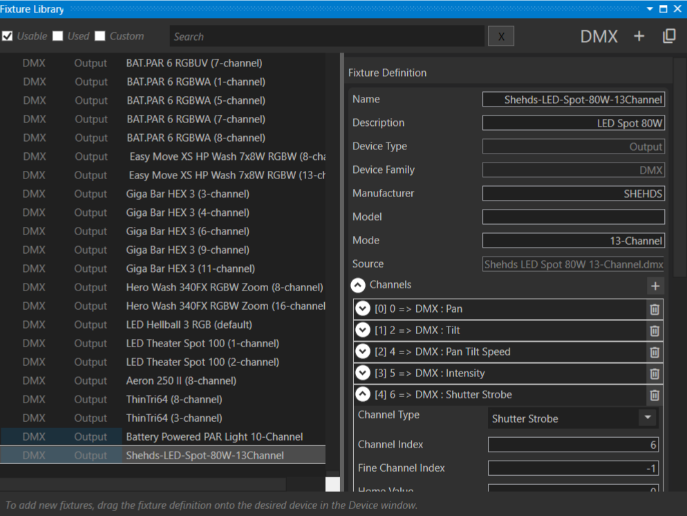

# Devices Window

The **Device Window** provides device management options:

- **Top-left corner** – Add new **DMX, Audio, or Video** devices.
- **Top-right corner** – Open the **Patch Window** and **Fixture Library**.
- **Middle section** – Displays the active **Venue** (only one supported).
- **Device List** – Shows available devices, their configurations, and outputs.

### Selecting Device Outputs

#### Audio Output

- Headphones, internal speakers, or other available audio devices.
- Multiple audio devices can target different outputs simultaneously.

#### DMX Output

- USB-to-DMX dongles.
- Future support for **Art-Net universe**.

#### Video Output

- **Preview Window** – Resizable within the application.
- **Monitor or Projector** – Fullscreen output for external displays.

## Adding Fixtures

Each device has three fixture-related buttons:

- **Add a new fixture**
- **Show/hide fixture list**
- **Show/hide fixture channel values**

{ width=75% }

### Fixture List

For each fixture, the list displays:

- **Start address**
- **Fixture name**
- **Channel definitions**
- **Duplicate and delete options**

Selecting a fixture opens the **Property Inspector**, where you can:

- Modify start addresses.
- Rename fixtures.
- Change fixture definitions.

{ width=50% }

If fixture channels overlap, the row is highlighted **red** to indicate a potential misconfiguration.

### Duplicating Fixtures

To quickly configure multiple fixtures of the same type, use the **Duplicate** button. The new fixture adopts the same definition and is assigned an appropriate address.

### Adding a Fixture

- **Blank Fixture** – Click **+** to add a new fixture with the most recently used definition.
- **From Fixture Library** – Open the **Fixture Library Window** to browse and drag a fixture definition onto the device.

### Creating a Custom Fixture Definition

If no suitable definition exists, create a **Custom Fixture Definition** by:

1. Clicking the **+** button in the top-right corner.
2. Providing **name, mode, and channels**.

For **DMX devices**, fixture definitions are sourced from [Open Fixture Library](https://open-fixture-library.org/).

## Patching Gizmos

By default, Masque generates a **Gizmo** for each fixture in a Venue. This behavior can be adjusted in settings.

- **Single Gizmo -> Single Fixture** – Renaming affects both.
- **Single Gizmo -> Multiple Fixtures** – Allows controlling multiple fixtures as one.

### Case Study: Controlling Multiple CYC Fixtures with One Gizmo

Using a single Gizmo for multiple **CYC fixtures** simplifies control. To patch fixtures:

1. Open the **Patch Window** (cable button in **Devices Window**).
2. Drag fixtures onto the Gizmo you want to control them.

{ width=75% }

---
