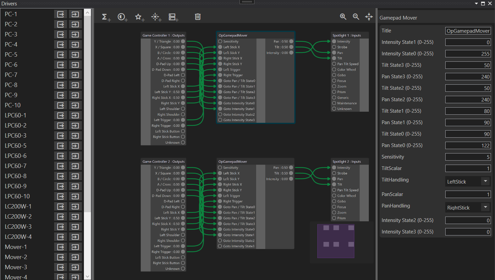
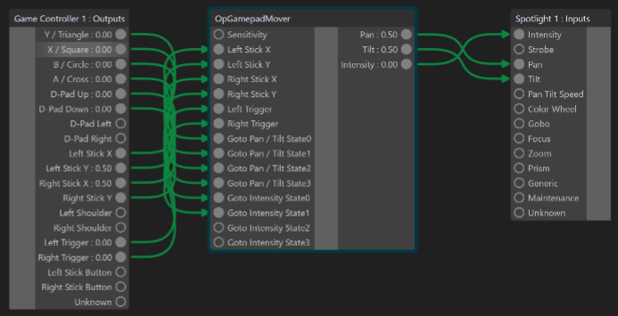
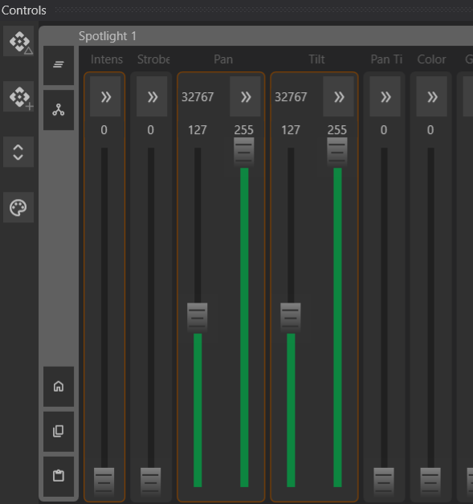

---
title: Drivers Window
layout: default
nav_order: 7
parent: Documentation
---

# Drivers Window

The **Drivers Window** allows configuring submasters, gizmos, and external controllers to drive gizmo channels.

## Nodes

Each gizmo in the station can be represented as an **Input** or **Output** node. These nodes can be linked together so that the output from one channel drives the input of another.

- Enable **Input/Output nodes** by selecting a gizmo in the left-hand panel and clicking the respective button.
- Connect inputs and outputs by clicking and dragging from an **input channel** to an **output channel**.

{ width=75% }

Channels that are being controlled will be highlighted in **orange** in the **Controls Window**. You can manually override these values by adjusting the fader, which will then be highlighted in **green**. To revert to the controlled value, click the **Clear Experimental Value** button .

{ width=75% }

## Operations

Operational nodes modify how outputs communicate with inputs. All channel values in the **Drivers Window** are normalized between **0 and 1**, ensuring compatibility.

### Math Operations

- **Static Value** - Outputs a fixed value.
- **Add** - Adds two input values.
- **Multiply** - Multiplies two inputs.
- **Max** - Outputs the maximum of two inputs.
- **Min** - Outputs the minimum of two inputs.
- **Clamp** - Restricts a value within a specified range.
- **Remap** - Converts an input range to a different output range.
- **Accumulator** - Accumulates values over time (negative input decreases value).
- **Exponential** - Applies an exponential curve transformation.

### Logic Operations

Logical operations treat values as **true (non-zero)** or **false (zero)** and output either **0 (false)** or **1 (true).**

- **And** - Outputs true if both inputs are true.
- **Or** - Outputs true if at least one input is true.
- **Not** - Inverts the input value.
- **ExclusiveOr** - Outputs true if only one input is true.
- **Conditional** - Outputs **Input A** if a test value is greater than a threshold; otherwise, outputs **Input B**.

### Effect Operations

Effect operations behave similarly to **Channel Effects** and can be used to dynamically modify values.

- **SinWave** - Generates a sine wave output.
- **Pulse** - Creates a periodic pulsing effect.
- **Cycle** - Interpolates between multiple values over time, with optional randomization.

### System Operations

The **Drivers Window** supports complex graphs for advanced functionality. Some common operations have been packaged into single nodes for ease of use.

- **Gamepad Mover** - Allows an **XInput-compatible gamepad** to control a **mover's Pan/Tilt** channels and **intensity** using triggers. Supports up to **four controllers** simultaneously.

---

