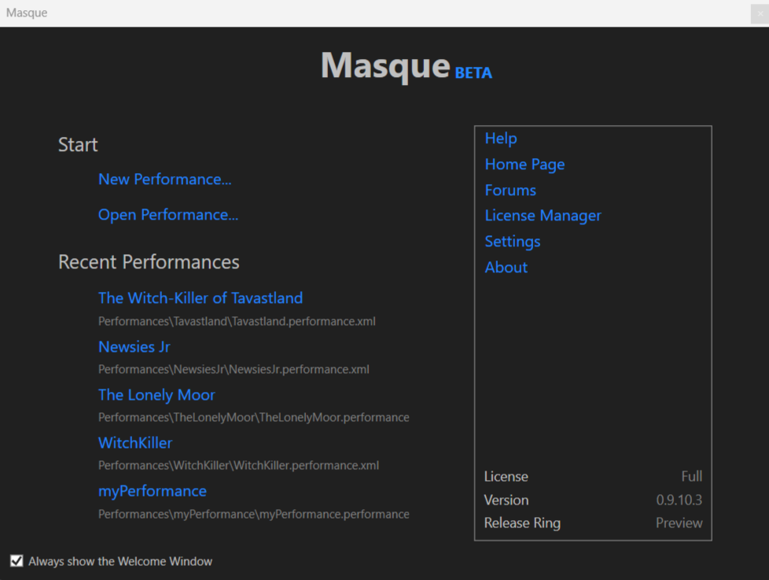
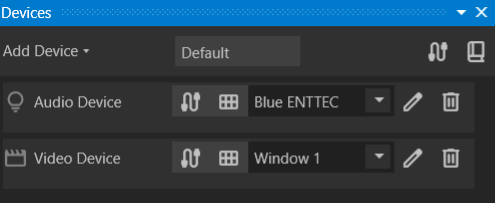
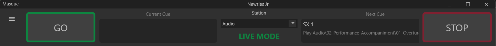
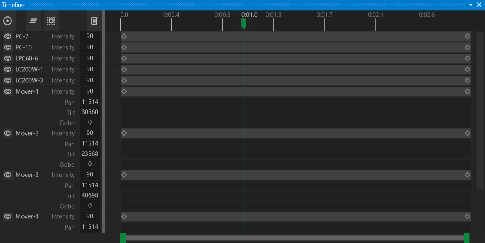

# Running a Performance

This guide walks you through loading a performance and using the essential features to run it.

## The Welcome Window

The Welcome Window provides quick access to common operations when starting Masque.

## Loading a Performance

When Masque opens, it automatically loads the most recent performance. To load a different performance, click the `Open` button in the toolbar and select the desired performance file. You can also load a performance from the Welcome Dialog.

## Station Setup

A performance consists of multiple stations, each configured for a specific technician. Common setups include:

- **Audio Station** – Manages music and sound effects.
- **Lighting Station** – Controls DMX fixtures such as lights and smoke machines.
- **Projection Station** – Manages projected visuals.

At the top of the application, the **Performance Bar** features a dropdown menu to switch between available stations. Changing stations also updates the window layout to match the station’s tasks.

## Device Setup

Each station controls a set of devices. For example, an Audio Station may target internal speakers, a headphone jack, or a USB-to-DMX connector. Stations can also output to multiple devices simultaneously.

To configure devices:

1. Open the **Devices Window**.
2. Select a target device from the list.
3. Use the dropdown menu to choose from available system devices.

Masque supports hot-plugging, meaning the list updates as devices are connected or removed. The station retains the last selected device.

## The Performance Bar

At the top of the window, you’ll find large **GO** and **STOP** buttons:

- **GO** advances to and runs the next cue.
- **STOP** halts the current cue.

Cue details are displayed:

- **Current Cue** – Shows the most recently played cue.
- **Next Cue** – Displays the upcoming cue.

The Performance Bar also displays the active station and Masque’s mode:

- **Live Mode** – For running shows.
- **Design Mode** – For making changes.

To switch to **Live Mode**, use the dropdown in the lower-right corner or press **F2**.

## The Cue Window

### Cue Lists

Below the Performance Bar, the **Cue List Bar** displays available cue lists. Multiple cue lists allow flexibility, such as:

- Pre-Show
- Post-Show
- Music Cues
- Music Cues (with Vocals)

To switch between lists, simply click on them.

### Cue Navigation

Use the **Prev** and **Next** buttons on the left to select the next cue manually. This feature is useful for repeating or skipping cues as needed.

### Master Fades

Each station has **Master Fade** controls for:

- **Audio** – Adjusts volume levels.
- **Video** – Fades or cuts to black.
- **DMX** – Controls lighting intensity or blackout.

Click the tilted **hamburger button** to reset a Master Fade to its default value.

## The Canvas and Controls Windows

The **Canvas Window** lets designers arrange gizmos—controls that manage device fixtures. Clicking a gizmo opens additional controls for real-time adjustments, useful for DMX lighting.

To restore a channel to its cued value, click the tilted **hamburger button**.

## The Timeline Window

The **Timeline Window** visualizes all actions in the current cue. It provides play, pause, advance, and fallback controls, useful for repeating specific audio cue sections during rehearsals.

---
