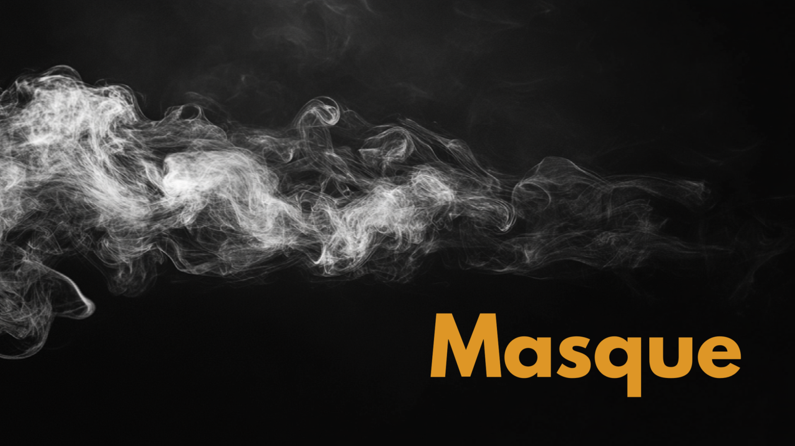

# Masque

Masque is a performance control application designed for live events, theater productions, and installations. It provides a centralized platform for managing audio, lighting, and visual cues in real-time.
