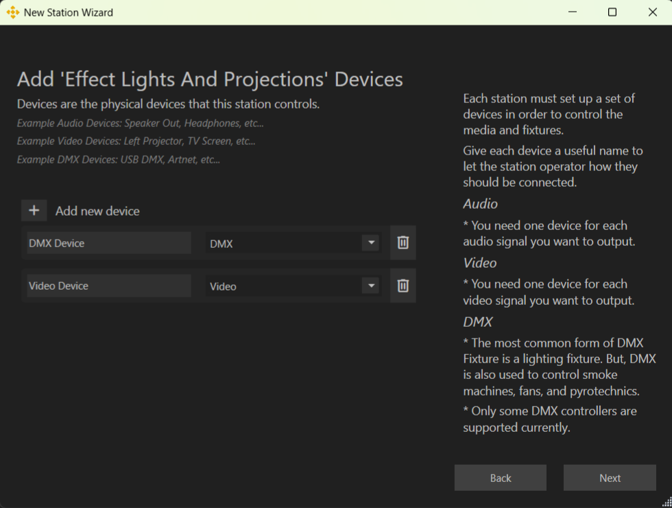

# Setting Up a Station

A **Station** contains cue lists, cues, actions, and gizmos. It also includes a **Venue** definition, which consists of devices, fixtures, and fixture definitions. **Gizmos** and **fixtures** are patched together so that cue actions can control the gizmos, which in turn drive the fixtures. Currently, only one **Venue** is supported per Station.

You can create a new **Station** through the **Performance Wizard** or by clicking the **+** button on the **Performance Bar** next to the station selection dropdown.

All **Venue** information is available in the **Devices Window**, accessible from the app’s sidebar.

## Creating a New Performance

To set up a Station, you need a **Performance**. If you’re not using an existing one, create a new Performance from the **Welcome Screen** or **Menu dropdown**.

### New Performance Wizard

The **New Performance Wizard** guides you through creating a performance. Start by assigning it a name and choosing a file location. By default, performances are stored in `My Documents\Performances`.

{ width=75% }

A **Performance** consists of multiple **Stations** that share media for synchronized execution. This includes:

- Audio and Video Media
- Palettes
- Effects
- Shader Effects

After setting up a performance, the wizard proceeds to the **New Station Wizard**.

## Setting Up a New Station

{ width=75% }

### Import a Previous Station

Importing a station preserves **devices, fixtures, and patching** from an existing performance. It does **not** import:

- Media
- Cues
- Cue Lists

### Create a Default Station

These pre-configured stations help you get started quickly:

- **Audio Station** – Includes default audio track fixtures.
- **Projection Station** – Comes with preconfigured video layer fixtures.
- **Lighting Station** – No default fixtures (as setups vary per production).

### Create a Custom Station

When setting up a **Custom Station**, you can:

1. Add devices and assign fixtures before completing setup.
2. Create an empty station and configure it later.

{ width=75% }

Once a station is created, additional fixtures and devices can be added.

{ width=75% }
{ width=75% }

## Editing Station Information

To modify station details:

1. Click the **Edit** button next to the **Station dropdown** in the **Performance Bar**.
2. You can rename the station, add a description, or locate it on disk.

## Exporting Station Cues

In the **Property Inspector**, you can export all cues for a station using the **Export** button.

## Configuring Devices

Each device has a drop-down that defines what target the device is writing out to. An Audio Device can target internal speakers, headphons, or any other audio hardware on the system. A Video Device can target any monitor or target a Window for Previewing.

### Adding Fixtures

- Click the Cable button to show all fixtures on this device.
- **Blank Fixture** – Click **+** to add a new fixture with the most recently used definition.
- **From Fixture Library** – Open the **Fixture Library Window** to browse and drag a fixture definition onto the device.

### Duplicating Fixtures

To quickly configure multiple fixtures of the same type, use the **Duplicate** button. The new fixture adopts the same definition and is assigned an appropriate address.

See the [Devices Window](Devices.md) for more detailed information.

## Gizmos on the Canvas

Each Gizmo created is automatically placed on the Canvas. While the system attempts to arrange them logically, they often need adjustment to suit the user's needs.  

Click the **Translate** button in the Canvas Toolbar to enable movement and rotation controls for each Gizmo. Alignment buttons will also appear, allowing you to easily align multiple Gizmos with one another.

See the [Canvas Window](Canvas.md) for more information.

---
