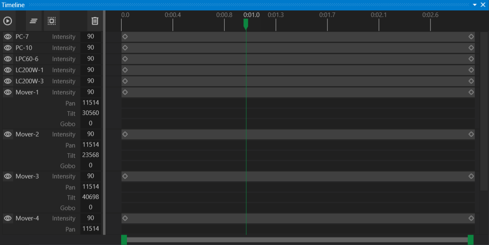

# Timeline Window

The **Timeline Window** visualizes all actions in the current cue. It provides play, pause, advance, and fallback controls, useful for repeating specific audio cue sections during rehearsals.

## Creating Actions from the Timeline

The **Timeline Window** displays all actions for the currently active cue.  

- Use the **scrub bar** to move through the cue’s actions.  
- When the cue is playing, playback controls appear at the bottom of the Timeline Window, allowing you to:  
  - **Pause**  
  - **Restart**  
  - **Skip forward or backward** (15-second increments)  

Each Gizmo with actions in the cue appears in the Timeline. Primary channels and channels with actions are shown by default. Clicking the **eye button** reveals all channels for a Gizmo.

## Adding and Editing Actions

- **To add an action**, double-click on a track in the Timeline. A new action will be created, and the **Property Inspector** will open for customization.  
- **To move an action**, drag it forward or backward in the Timeline to change its start time.  
- **To adjust action duration**, drag the edges of the action bar to shorten or lengthen it.  

**Note:** For audio and video actions, trimming the action also clips the media playback to the defined duration.

---
