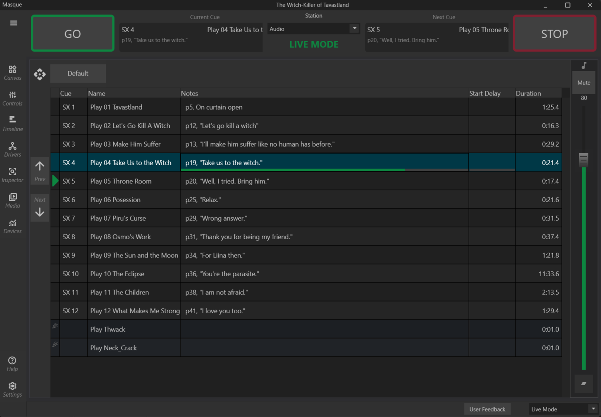

# Masque

----

[Download the Latest Version](https://github.com/masqueworks/masque-app-deploy/releases/download/v0.9.10.8/Masque-0.9.10.8-Installer.msi){: .btn }
  
(_**Masque is currently a Windows only program.**_)  
  
[Masque-0.9.10.8-Installer.msi](https://github.com/masqueworks/masque-app-deploy/releases/download/v0.9.10.8/Masque-0.9.10.8-Installer.msi)    
  
[Latest Release Notes](./releasenotes.html)    
  

_This software uses code of [FFmpeg](http://ffmpeg.org) licensed under the [LGPLv2.1](http://www.gnu.org/licenses/old-licenses/lgpl-2.1.html) and its source can be downloaded [here](https://github.com/BtbN/FFmpeg-Builds/releases/tag/autobuild-2024-08-31-12-50)._

